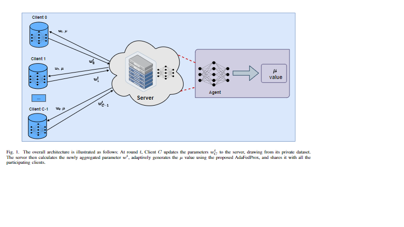
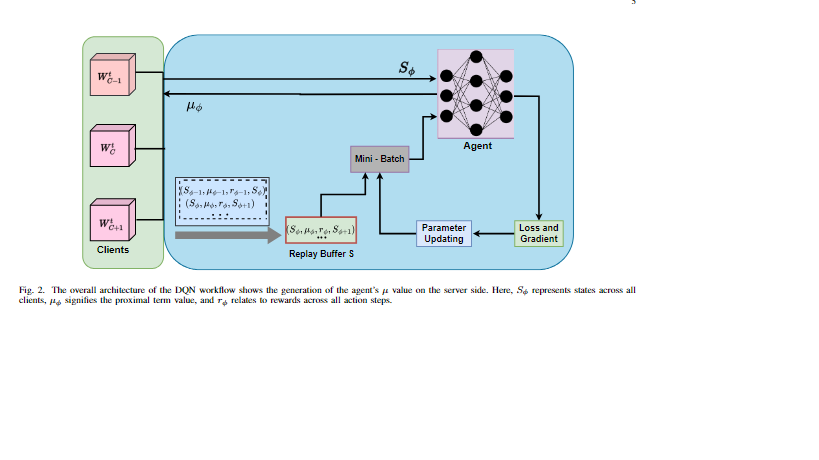

# AdaFedProx: A Heterogeneity-aware Federated Deep Reinforcement Learning for Medical Image Classification
This repository includes the source code for paper entitled: "AdaFedProx: A Heterogeneity-aware Federated Deep Reinforcement Learning for Medical Image Classification" published in IEEE Transactions on Consumer Electronics.

## Abstract

In the realm of smart healthcare, vast amounts of valuable patient data are generated worldwide. However, healthcare providers face challenges in data sharing due to privacy concerns. Federated learning (FL) offers a privacy-preserving solution by enabling collaborative model training without direct access to patient data. This decentralized approach utilizes data from diverse sources, resulting in a globally learned model with satisfactory performance across individual sites. However, federated training encounters challenges such as "systems heterogeneity" in client specifications and "data heterogeneity" in imbalanced data distribution. Standard FL methods become unstable and require extensive hyperparameter tuning for optimal performance when facing heterogeneous clients, posing challenges in real-world applications. This research introduces a novel heterogeneity-aware federated learning approach named AdaFedProx to address the performance degradation resulting from heterogeneity. AdaFedProx utilizes a reinforcement learning-driven strategy, introducing a tailored proximal term into the objective function to incorporate partial client information in heterogeneous settings. Dynamically determining the proximal term based on individual client states, including critical characteristics like data distribution, system specification, and performance feedback, empowers AdaFedProx to make regularized decisions throughout the federated training. AdaFedProx consistently outperforms four state-of-the-art methods on three medical datasets across diverse heterogeneity settings (0%, 50%, and 75% straggler).

## Dependencies
* Tensorflow = 2.10.0
* scikit-learn = 1.3.2
## Dataset (ISIC 2018 and Messidor)
Please download the ISIC 2018 using this  [link](https://challenge.isic-archive.com/data/#2018) and Messidor dataset using this [link](https://www.adcis.net/en/third-party/messidor/). The CIFAR10 dataset can be used by importing from tf_datasets.

## Data Preparing
To divide the dataset into the aprequired no. of clients, divide the data into training, validation and testing set as mentioned in the paper, then run non_iid_data_preparation.py and choose the required dataset (ISIC 2018 and Messidor) and then change the degree of heterogenity (eta) as required. you will get the desired distribution for each client.

## Model Structure
To choose the pretrained model, run model.py.

## Run FedMRL

After done with above process, you can run the FedMRL, our proposed method.

## Evaluation
After federated training, run Evaluation.py to acess the evaluation metrics such as accuracy, precision, recall etc.

## Citation
@misc{sahoo2024fedmrldataheterogeneityaware, 
      title={FedMRL: Data Heterogeneity Aware Federated Multi-agent Deep Reinforcement Learning for Medical Imaging},  
      author={Pranab Sahoo and Ashutosh Tripathi and Sriparna Saha and Samrat Mondal}, 
      year={2024}, 
      eprint={2407.05800}, 
      archivePrefix={arXiv}, 
      primaryClass={cs.LG}, 
      url={https://arxiv.org/abs/2407.05800},  
}
